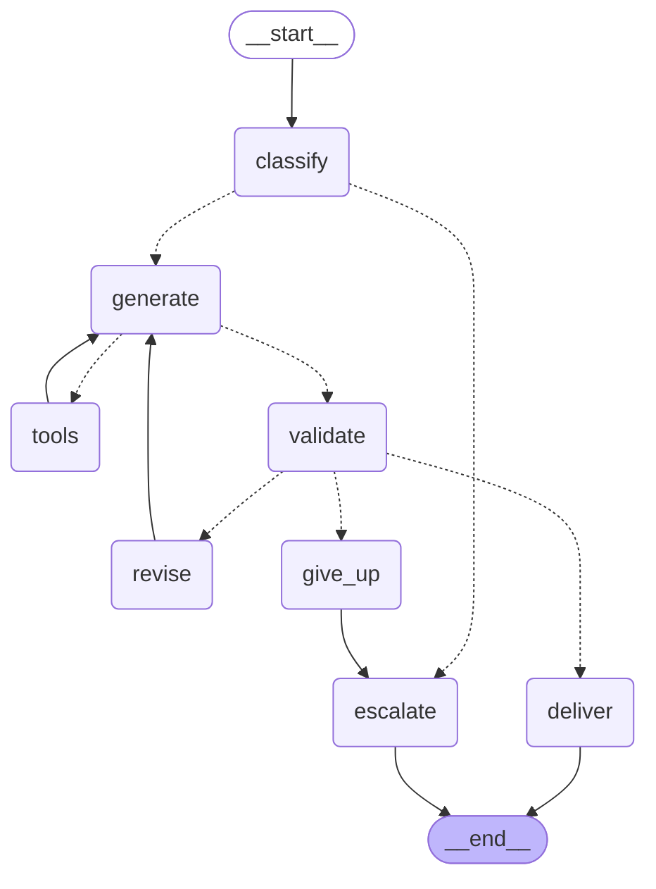

# nova-langgraph-agent

[](https://github.com/Aleco127/nova-langgraph-agent/actions/workflows/ci.yml)
[](docs/quality-gates.md)
[](.github/workflows/ci.yml)
[](.github/workflows/ci.yml)
[](https://sonarcloud.io/summary/new_code?id=Aleco127_nova-langgraph-agent)

A conversational sales agent modelled as an explicit state machine, and a
pipeline whose quality gates actually block a merge.

The agent replaces a production WhatsApp and web chatbot that handles inbound
sales across five channels. This repository reimplements its flow rather than
porting it: the production service is an 80k-line monolith whose configuration
carries live API credentials, so it can neither be made public nor brought into
the green.

## The graph

<!-- generated by `python -m nova_agent --diagram`; tests/test_docs.py fails if this drifts -->



Generated from the compiled graph, not drawn by hand. A test compares this block
against `draw_mermaid()` on every run, so a diagram that disagrees with the code
is not a state this repository can reach.

## Why a graph and not a chain

The business rule is ordinary: **the agent must never quote a price that is not
in the catalog.** Stating it in the system prompt is necessary and not
sufficient — the failure mode is fluent, confident text that breaks a constraint
the prompt already gave. So the output has to be checked, and a reply that fails
the check has to be redrafted.

That is a cycle, and a chain is a straight line. With `prompt | model | parser`
there are exactly two ways to enforce the rule:

1. **Check after the fact and send it anyway.** The customer already has the
   wrong price. They will hold the business to it.
2. **Wrap the chain in a Python `while` loop.** This is the honest alternative,
   and it is worth being specific about what it costs, because "just write a
   loop" is a fair objection.

Take the second seriously. The loop needs a ceiling, or a model stuck on the
same mistake bills for calls until something else breaks. It needs to carry the
draft, the failure reason, the attempt count and the tool results between
iterations — which is a state object, hand-rolled. It needs to decide where to
go when the ceiling is hit, and "return the last draft" is wrong here, because
that draft is precisely the one that failed. It needs the same treatment for the
tool-calling cycle, which has its own ceiling and its own exit. And when the
turn stops to wait for a human, it needs that state to survive the process, so
it needs somewhere to persist it and a way to resume mid-flight.

At that point the loop *is* a state machine — just one where the transitions are
implicit in control flow, undrawable, and testable only end to end. What the
graph adds is not power; it is that every one of those decisions has a name:

| Concern | Where it lives |
|---|---|
| Ceiling on redrafts | `MAX_GENERATION_ATTEMPTS`, checked in `route_after_validate` |
| Ceiling on tool rounds | `MAX_TOOL_ROUNDS`, checked in `route_after_generate` |
| What happens when a ceiling is hit | An edge to `give_up`, then `escalate` |
| State carried between iterations | `ConversationState`, one typed object |
| Surviving a pause for a human | Checkpointer + `interrupt`, `Command(resume=...)` |

And it makes the interesting property testable in isolation. `test_graph.py`
asserts *which edge was taken* — that an exhausted turn reaches a person rather
than sending its last draft, that a turn asking for a human never reaches the
model at all, that the tool ceiling holds. Those are properties of the wiring.
Against a hand-rolled loop they are only reachable by running the whole thing
and inspecting what came out.

The cycle is also why the retry is not just a retry: `revise` feeds the model
the *specific* rule it broke. A bare "try again" tends to return the same reply
with the adjectives moved around.

## What is here

| Module | What it decides |
|---|---|
| `contacts.py` | The phone and email hidden in free text, normalised to one canonical form |
| `intent.py` | Which sales script applies, and why a later message must not change it |
| `escalation.py` | When to stop answering and hand over to a person |
| `validation.py` | Whether a draft is fit to send, and what to tell the model if not |
| `catalog.py` / `tools.py` | The prices the agent may quote, as data and as tools |
| `prompts.py` | The system prompt for each sales script |
| `state.py` | The one typed object every node reads and writes |
| `nodes.py` | Thin wrappers: read state, call one of the above, return what changed |
| `graph.py` | The wiring, the ceilings, and the three routers |
| `checkpointing.py` | Memory between turns, with an explicit deserialisation allowlist |
| `replay.py` | Deterministic replay of a conversation, for tests and for debugging |

The first six are pure functions with no LangGraph import, tested by calling
them. That separation is deliberate: the graph tests are then free to assert
only what a graph can get wrong.

## Three things building it turned up

**The tool router was reading the wrong thing.** It decided whether a draft had
asked for tools by inspecting the last element of `messages`. `add_messages`
merges by message id rather than appending, so a redraft can land back in the
first draft's slot and leave a tool result at the tail — silently turning a
ceiling of two tool rounds into one. `generate` now records the count as state.

**Sending a full state into an existing thread erases its memory.** A graph
input is merged field by field into the checkpointed state, so a populated
`new_state` overwrites `history` with the empty list it was initialised with.
Nothing raises. The agent simply greets a customer it has been talking to for
ten minutes, with the transcript intact in the database one field away.
`turn_input` exists for later turns and a test pins the difference.

**The checkpointer deserialises whatever the record names.** LangGraph's
serialiser defaults to permissive and warns, in its own docstring, that an
attacker able to write to the checkpoint store may reach code execution through
it. For this agent that store holds customer conversations. `checkpointing.py`
passes an explicit allowlist of the four project types that ever enter a
checkpoint; anything else comes back as inert data with no constructor called.

## The gates

**Coverage.** `pytest --cov-fail-under=95`, enforced on the runner with no
external service involved. The suite reports 100%; the floor sits at 95 because
pinning a gate to the current number turns every guard clause into a build
failure, and a team that cannot add one without writing a ceremonial test learns
to bypass the gate instead.

Coverage is gated twice, and the two catch different things. The floor above is
absolute and cannot see a repository that sits comfortably above it while
absorbing untested code; SonarQube Cloud measures Coverage on New Code, computed
against the change rather than the total. `sonar.qualitygate.wait=true` makes the
workflow block on the verdict instead of firing the analysis and moving on.

**Vulnerabilities.** Trivy, `--severity HIGH,CRITICAL --exit-code 1
--ignore-unfixed`. That last flag is the difference between a gate people respect
and one they route around: without it a CVE with no released patch keeps the
pipeline red indefinitely. `.trivyignore` is empty, and every entry it ever gains
must carry a justification and a review date.

The image scan also uploads SARIF to GitHub code scanning. Two scans run, not
one: the reporting scan cannot fail, so a run that trips the gate still produces
the report explaining why.

## Evidence

A pipeline that has only ever been green proves nothing about its gates.
[`docs/quality-gates.md`](docs/quality-gates.md) records every run where one
closed:

1. **Unplanned.** The first scan of this repository found **11 HIGH findings**,
   all with released fixes — nine in `util-linux` from a base image older than
   the security archive, two from pip's vendored `msgpack` and `setuptools`.
   Fixed by upgrading at build time and removing pip from the runtime image, so
   the count went to **0** with `.trivyignore` still empty.
2. **Planned.** [PR #1](../../pull/1) shipped a module with no tests and a pinned
   `setuptools==70.3.0`. Coverage fell to 81% and the scan found the CVE; both
   gates blocked, while lint, formatting, build and the container smoke test
   passed — each gate failed for its own reason and nothing else.
3. **Green.** The same PR, after writing the tests and removing the dependency.
   Neither threshold was lowered.
4. **What the New Code gate caught.** Eight untested lines in a repository
   already at 100% leave the total at 95.38% — above the floor, invisible to it.
   The Sonar gate blocked; it had not, on the first attempt, because SonarQube
   Cloud ignores coverage conditions on changes under 20 new lines by default.
   With that off it also found super-linear backtracking in two regexes parsing
   customer-supplied text, which neither `ruff` nor 100% coverage says anything
   about.
5. **The LangGraph milestone.** 33 new transitive dependencies entered the image
   and the vulnerability gate passed on the first scan with no suppressions. The
   findings that milestone did produce came from the tests, not the scanners:
   three defects listed above, plus an escalation pattern that accepted "hablar
   con una persona" but not "hablar con un asesor".

`main` currently reports 0 bugs, 0 vulnerabilities, 0 code smells and 0 security
hotspots at 100% coverage.

## Running it

```console
python -m venv .venv && . .venv/bin/activate
pip install -e ".[dev]"
ruff check . && ruff format --check .
pytest --cov=nova_agent --cov-fail-under=95
```

Three modes, none of which needs an API key:

```console
# the deterministic half of a turn -- no model involved
python -m nova_agent "quiero una pagina web, mi cel 33 1234 5678"

# the whole graph, with the model's answers scripted:
# first draft quotes a price that does not exist, second one is redrafted
python -m nova_agent "cuanto cuesta el bot" \
    --replay "Te lo dejo en \$1,800." \
    --replay "El setup es de \$2,499 y son 650 pesos al mes."

python -m nova_agent --diagram
```

Wiring a real model is one argument:

```python
from langchain_anthropic import ChatAnthropic
from nova_agent.checkpointing import build_checkpointer
from nova_agent.graph import build_graph
from nova_agent.state import new_state, turn_input

agent = build_graph(ChatAnthropic(model="claude-sonnet-4-5"), checkpointer=build_checkpointer())
config = {"configurable": {"thread_id": "wa-5213312345678"}}

agent.invoke(new_state("hola, cuanto cuesta?", channel="whatsapp"), config)
agent.invoke(turn_input("y con dos numeros?"), config)  # not new_state -- see above
```

The container, and the same scan CI runs:

```console
docker build -t nova-agent .
docker run --rm nova-agent "quiero hablar con un asesor"
trivy image --severity HIGH,CRITICAL --ignore-unfixed --exit-code 1 nova-agent
```

## Notes on the runtime image

It carries no package manager. Removing pip took out its vendored `msgpack` and
`setuptools` — two of the eleven findings above — and it also means a process
that gets code execution here has nothing to fetch its next stage with. Nothing
in the runtime path imports pip, so there is no cost to this.

Memory is in-process. A Postgres checkpointer is a two-line swap and the right
answer in production, but it would put a database container between the test
suite and every graph assertion, which is how a fast suite becomes one nobody
runs before pushing.
